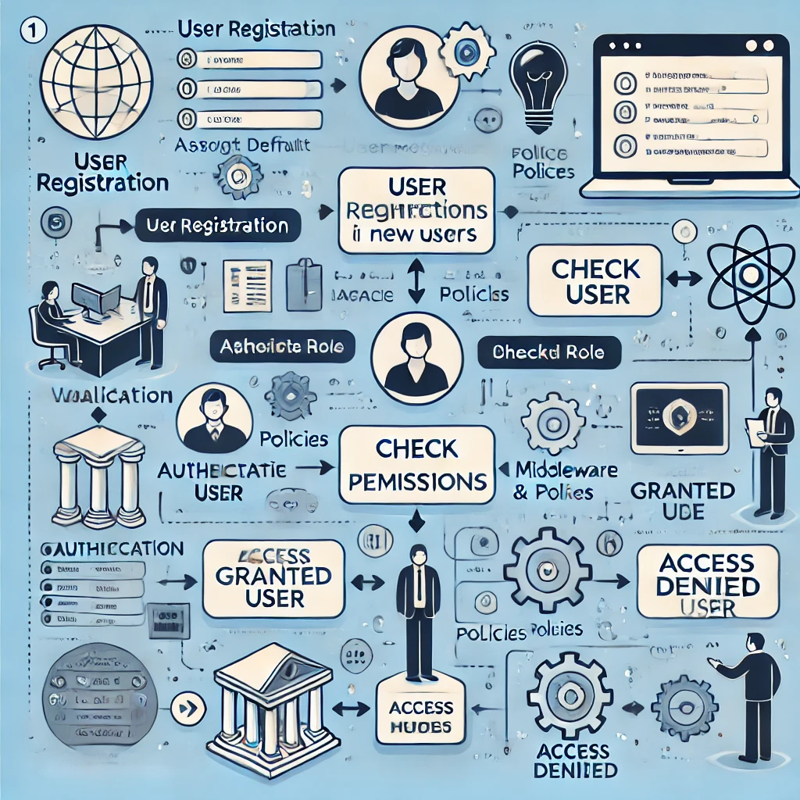

Here’s a **workflow chart** describing how the **User Module** functions in your Aaran-BMS system, including **authentication, roles, and permissions**.

---

### **🛠 User Module Workflow Steps:**
1️⃣ **User Registration/Login**
- User submits credentials via **Blade UI** or API.
- The request is validated using **`UserRequest`**.
- The **UserController** processes authentication.
- If successful, a session or API token is created (Laravel Sanctum).

2️⃣ **Role & Permission Assignment**
- Upon registration, the **default role** (`user`) is assigned (from `config/auth.php`).
- Admin can update roles using the **UserRepository**.
- Roles & permissions are fetched dynamically from the database.

3️⃣ **Authorization Check (Middleware & Policies)**
- Each request passes through **`EnsureUserHasPermission` Middleware**.
- If a user lacks permissions, access is denied.
- Policies (like `UserPolicy`) check if the user has rights to **view/update users**.

4️⃣ **Data Access & Management**
- Users, roles, and permissions are managed via the **Admin Panel** (UI) or API.
- **Repositories handle CRUD operations** for users, roles, and permissions.
- Migrations ensure correct **schema structure** for `users`, `roles`, `permissions`, etc.

---

### **📊 Workflow Diagram**
```
           +----------------------+
           |  User Registration   |
           +----------------------+
                      |
                      v
           +----------------------+
           |  Validate Request     |
           +----------------------+
                      |
                      v
           +----------------------+
           |  Assign Default Role  |
           +----------------------+
                      |
                      v
      +----------------------------------+
      |  Authenticate User (Sanctum)    |
      +----------------------------------+
                      |
                      v
           +----------------------+
           |  Check Permissions   |
           +----------------------+
                      |
      +--------------------+-----------------+
      | Yes (Allow Access) |  No (Deny)      |
      |                    |                 |
      v                    v                 |
+----------------+    +----------------+     |
| Load User Data |    | Access Denied  |     |
+----------------+    +----------------+     |
      |                                      |
      v                                      |
+----------------+                           |
| Show Dashboard |                           |
+----------------+                           |
      |                                      |
      v                                      v
+----------------+                 +----------------------+
|  User Management | <--------------| Admin Updates Roles |
+----------------+                 +----------------------+
                      |
                      v
           +----------------------+
           |  Update DB Records   |
           +----------------------+
                      |
                      v
            (End of Flow)
```

---

### **Key Components in This Flow**
1️⃣ **Controllers**: Handle requests (`UserController`).  
2️⃣ **Repositories**: Perform CRUD operations (`UserRepository`).  
3️⃣ **Middleware**: Restrict unauthorized access (`EnsureUserHasPermission`).  
4️⃣ **Policies**: Manage fine-grained permissions (`UserPolicy`).  
5️⃣ **Blade Views & API Routes**: Provide access points.

---


