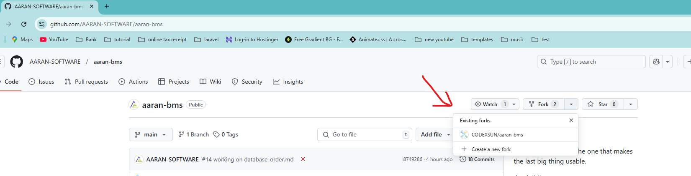

# Installation

How to Install Aaran-BMS Project from GitHub

# 1️⃣ Fork the Repository
Log in to your Github and type to search at top

```sh
  AARAN-SOFTWARE/aaran-bms
```
or

- Go to the GitHub repository,
https://github.com/AARAN-SOFTWARE/aaran-bms
---

Click the Fork option, then click Create Fork.

---

# 2️⃣ Open the Project in Your Code Editor
Open your favorite code editor (PhpStorm or VSCode) and clone the repository:

```sh
  git clone https://github.com/YOUR-USERNAME/aaran-bms.git
```

Navigate to the project folder:
```sh
  cd aaran-bms
```
---

# 3️⃣ Setting ENV file 
Copy .env.example and rename it to .env or type in terminal
```sh
  cp .env.example .env
```
---

# 4️⃣ Configure the .env File
Open .env and update the database settings:

  DB_DATABASE= <mark>your_database_name</mark></br>
  DB_USERNAME= <mark>your_database_user</mark></br>
  DB_PASSWORD= <mark>your_database_password</mark></br>
   
>Note : You can change these values if needed. However, ensure that the database exists and the credentials are correct. Otherwise, Laravel will not be able to connect to the database.
---

# 5️⃣ Install Dependencies using composer
```sh
  composer install
```
>   Note : If Composer is not installed, download it from https://getcomposer.org/download/
---

# 6️⃣ Install Node Modules
```sh
  npm install
```
>   Note : If npm is not installed, download it from https://nodejs.org/en

# 7️⃣ Generate Application Key
Run the following command to generate the application key:
```sh
  php artisan key:generate
```
---

# 8️⃣ Create Storage Link
Run the following command to create a symbolic link for storage:

```sh
  php artisan storage:link
```

# 9️⃣ Run Migrations
Run database migrations and seed data:
```sh
  php artisan migrate --seed
```
# 🔟 Build and Run Development Server
After installing dependencies, you can build and start the development server:
```sh
  npm run build && npm run dev
```
# 1️⃣1️⃣ Start Laravel Development Server
Serve the project locally:
```sh
php artisan serve
```
Visit http://127.0.0.1:8000 in your browser.

Now your Laravel project is fully set up! 🚀
